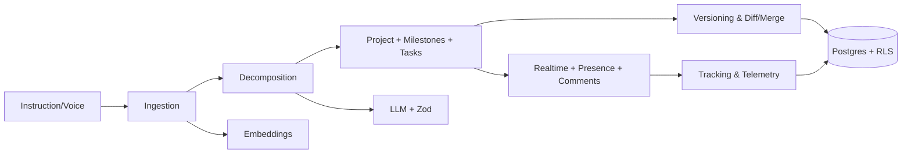

# AI-Driven Project Management Architecture

## Core Services
- Instruction Ingestion: validate, embed, link to prior context.
- Decomposition: LLM with Zod-validated outputs; deterministic validators.
- Project Recreation: diff, merge, versioning; approvals; rollback.
- Collaboration: presence, realtime subscriptions; role-based permissions.
- Progress Tracking: status transitions, forecasts, reports.

## Data Model
- Tables: `projects`, `milestones`, `tasks`, `voice_sessions`, `schema_migrations`, `migration_audit`, `down_migrations`.
- Views: compatibility views linking voice sessions.
- RLS: policies on core tables and voice tables.

## Integration Points
- API: `src/app/api/instructions/route.ts` for instruction parsing.
- AI: `src/lib/services/openai-project-manager.ts` for structured outputs.
- UI: `src/app/voice/page.tsx` + voice components for tabbed workflows.

## Error Handling & Observability
- Route wrapper: `src/server/http/wrapRoute.ts` with Zod + standardized errors.
- Audit: migration audit tables and logs.
- Logger: centralized structured logging with correlation IDs.

## Extensibility
- Modular services and adapters; feature flags; transactional migrations.

